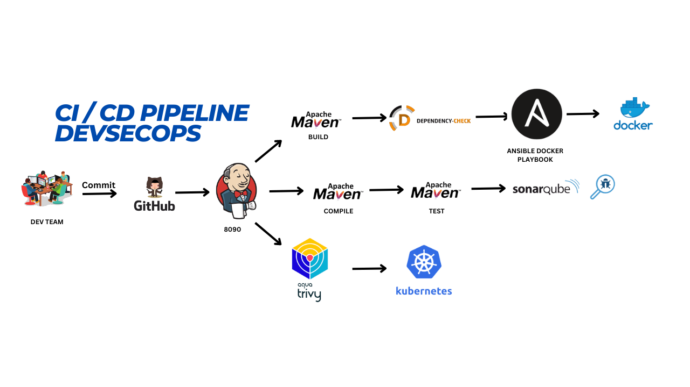

# Ansible DevSecOps Petshop Project with Jenkins CI/CD

This project demonstrates the deployment of a Java-based Petshop application using a combination of Jenkins for CI/CD, Docker for containerization, and Kubernetes for orchestration. It also incorporates Ansible to automate and manage the deployment process, showcasing a comprehensive DevSecOps approach.

## Overview

The project aims to:

- Automate the deployment of a Petshop application using Jenkins as the CI/CD tool.
- Utilize Docker containers for consistent and agile application hosting.
- Leverage Kubernetes clusters for scalable and orchestrated application management.
- Streamline and automate the deployment process with Ansible.

## Deployment Strategies

### Jenkins CI/CD

Jenkins orchestrates the entire deployment pipeline, ensuring that the application is built, tested, and deployed efficiently.

### Docker Containers

Docker containers are used for their agility and consistency, allowing for easy scaling and management of the application.

### Kubernetes Clusters

Kubernetes clusters are utilized to showcase scalability and orchestration capabilities, providing a robust platform for running the application.

### Ansible Automation

Ansible plays a pivotal role in automating and managing the deployment process, ensuring efficiency and consistency across environments.

## Pipeline Stages Explanation

The Jenkins pipeline stages are designed to automate various aspects of the software development lifecycle, focusing on the build, test, and deployment phases. Each stage represents a distinct subset of tasks performed throughout the pipeline. Below is an explanation of each stage based on the provided pipeline configuration and general Jenkins pipeline concepts:

### `clean Workspace`

- **Purpose**: Cleans the workspace before starting the build process to ensure a clean and consistent environment for each build.

### `checkout scm`

- **Purpose**: Checks out the latest version of the source code from the specified Git repository, ensuring the build process uses the most recent code changes.

### `maven compile`

- **Purpose**: Compiles the Java source code into bytecode using Maven, preparing the application for testing and deployment.

### `maven Test`

- **Purpose**: Runs the unit tests defined in the project to verify that the compiled code behaves as expected and to catch any issues early in the development cycle.

### `Sonarqube Analysis`

- **Purpose**: Performs static code analysis using SonarQube to identify bugs, vulnerabilities, and code smells, helping maintain code quality and security standards.

### `quality gate`

- **Purpose**: Checks if the project meets the predefined quality gates, which are criteria that must be met before the code can be considered ready for deployment. If the quality gate is not passed, the pipeline can be configured to abort or continue with further actions.

### `Build war file`

- **Purpose**: Builds the application into a WAR (Web Application Archive) file using Maven, a package format for web applications that can be deployed on application servers.

### `OWASP Dependency Check`

- **Purpose**: Scans the project's dependencies for known vulnerabilities using OWASP Dependency Check, helping identify and mitigate security risks associated with third-party libraries.

### `Ansible docker Docker`

- **Purpose**: Deploys the application using Docker containers by running an Ansible playbook (`docker.yaml`) that sets up Docker containers for the application, ensuring it is containerized and ready for deployment.

### `k8s using ansible`

- **Purpose**: Deploys the application on a Kubernetes cluster by running another Ansible playbook (`kube.yaml`). Kubernetes orchestration allows for scalable and managed deployment of the application, making it suitable for production environments.

Each stage in the pipeline is designed to automate and streamline the software development process, from compiling and testing the code to deploying it in a containerized and orchestrated environment. This approach facilitates continuous integration and continuous deployment (CI/CD), enabling frequent and reliable updates to the application.
